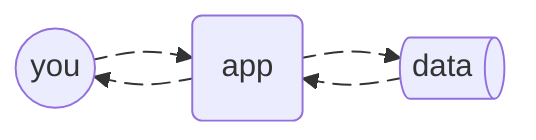
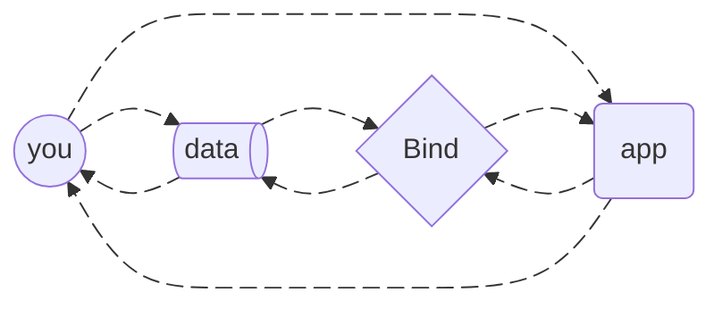

---
# https://vitepress.dev/reference/default-theme-home-page
layout: home

hero:
  name: "Bind"
  text: Git-backed web apps.
  tagline: Bring your own repo
  image:
    src: /identity.svg
    alt: VitePress
  actions:
    - theme: brand
      text: Quickstart
      link: /quickstart
    - theme: alt
      text: How it works
      link: /understand

features:
  - title: Your data in your control
    details: Keep it one place or many—up to you.
  - title: Permission-less, worry-less.
    details: Always accessible, even if the app isn't.
  - title: Highly interoperable
    details: Files, open protocols, infinite integrations.
---

::: info the traditional way

Go <em>'through'</em> apps to access your stuff. No app, no data.

:::

::: info the Bind way

Data starts in your hands. Give apps permission as necessary.
:::

  

