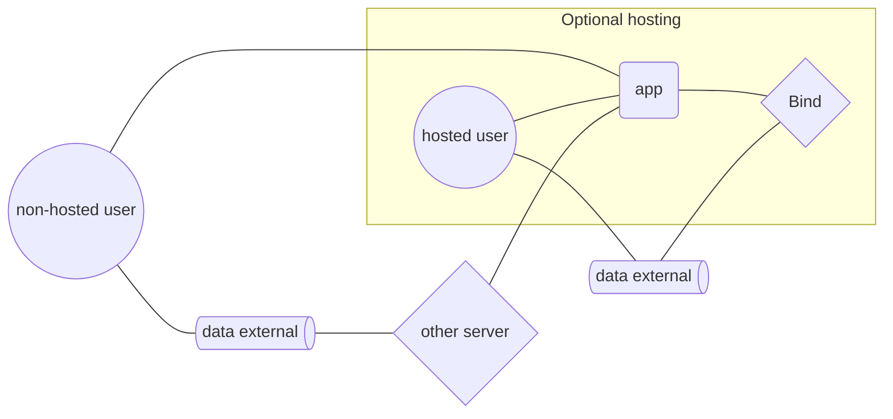

# Integrate

## Make apps

App development is much simpler with

- no backend infrastructure
- no hosting of other people's data
- no per-user costs
- no account systems

Just read and write data with the remoteStorage.js library and your web apps get:

- automatic syncronization
- offline-first data
- authentication
- personal data stores
- interoperable bridges

### Sample code

You might be familiar with `localStorage` for storing and retrieving objects:

```javascript
// store data
let todos = [{ name: 'buy vegetables' }, { name: 'read mail' }];
localStorage.setItem('app-data', JSON.stringify(todos));

// retrieve data
let todos = JSON.parse(localStorage.getItem('app-data'));
```

To turn this into a `remoteStorage` app, we write objects to a `scope`:

```javascript
const client = remoteStorage.scope('/todos/');
await client.storeFile('application/json', 'data.json', JSON.stringify(todos));
```

and read them similarly:

```javascript
const data = await client.getFile('data.json');
let todos = JSON.parse(data);
```

Now the app data will be syncronized when a personal data store is connected.

If you prefer separate files per object, just write to a different path for each one (they're just files):

```javascript
let edited = { name: 'buy vegetables', completed: true };
await client.storeFile('application/json', 't1.json', JSON.stringify(edited));
```

Skip JSON boilerplate by defining a type via JSON Schema, ignore validation by passing an empty object:

```javascript
client.declareType('todo-task', {});

// store object
await client.storeObject('todo-task', 't1', edited);

// retrieve object
await client.getObject('t1');
```

To get all items as a list:

```javascript
await client.getAll('');
// [{ name: 'buy vegetables', completed: true }, { name: 'read mail' }]
```

Read more about multiple scopes in the [remoteStorage.js documentation](https://remotestorage.io/rs.js/docs/data-modules/).

### Host

Hosting Bind is *optional*, but you might like to offer accounts for anyone who doesn't already have one. It's simple to run and works anywhere that supports Node.js and persistant storage.

Users can connect their own sources so that you take no custody over their data while still allowing people from other servers to bring their accounts to your web app.



## Other integrations

remoteStorage gives your Git repository a simple REST API that requires no special platform integration. Just use your Bind OAuth token to make GET or PUT requests from any browser or server and changes will sync to all apps that use the data.
