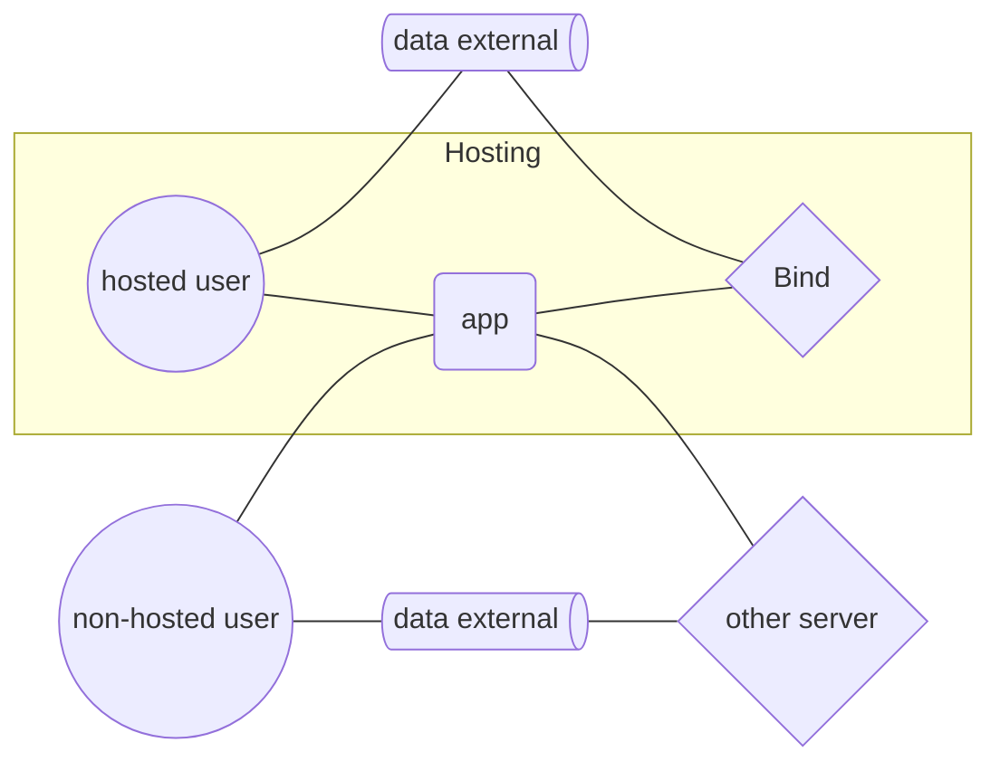

# Integrate

## Make apps

App development is much simpler with

- no backend infrastructure
- no hosting of other people's data
- no per-user costs
- no account systems

Just read and write data with the [remoteStorage.js library](https://remotestorage.io/rs.js/docs/why.html) and your web apps get:

- automatic syncronization
- offline-first data
- authentication
- personal data stores
- interoperable bridges

### Sample code

You might be familiar with `localStorage` for storing and retrieving objects:

```javascript
// store data
todos = [{ name: 'buy vegetables' }, { name: 'read mail' }];
localStorage.setItem('app-data', JSON.stringify(todos));

// retrieve data
todos = JSON.parse(localStorage.getItem('app-data'));
```

To sync this data across devices, we use `remoteStorage` and write objects to a `scope`:

```javascript
scope = remoteStorage.scope('/todos/');
await scope.storeFile('application/json', 'data.json', JSON.stringify(todos));
```

and read them similarly:

```javascript
todos = JSON.parse(await scope.getFile('data.json'));
```

Now the app data automatically syncs when a personal data store is connected.

If you prefer separate files per object, just write to a different path for each one (they're just files):

```javascript
edited = { name: 'buy vegetables', completed: true };
await scope.storeFile('application/json', 't1.json', JSON.stringify(edited));
```

Skip JSON boilerplate by defining a type via JSON Schema, ignore validation by passing an empty object:

```javascript
scope.declareType('todo-task', {});

// store object
await scope.storeObject('todo-task', 't1', edited);

// retrieve object
await scope.getObject('t1');
```

To get all items as a list:

```javascript
await scope.getAll('');
// [{ name: 'buy vegetables', completed: true }, { name: 'read mail' }]
```

Read more about [multiple scopes](https://remotestorage.io/rs.js/docs/data-modules/) and [change events](https://remotestorage.io/rs.js/docs/api/baseclient/classes/BaseClient.html#change-events).

### Host

Hosting Bind is *optional*, but you might like to offer accounts for anyone who doesn't already have one. It's simple to run and works anywhere that supports Node.js and persistent storage.

Users can connect their own sources so that you take no custody over their data while still allowing accounts from other servers to use your app.

<div class="way-host">



</div>

Offering storage locally on your server is also an option.

## Other integrations

remoteStorage gives your Git repository a simple REST API that requires no special platform integration. Just use your Bind OAuth token to make `GET` or `PUT` requests from any browser or server and changes will sync to connected apps and repos.
