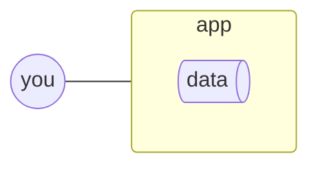
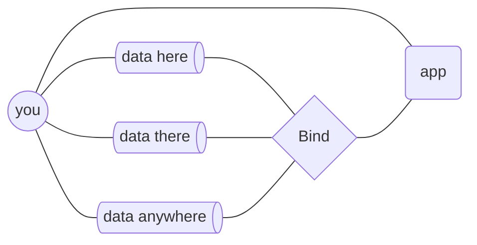

# How it works

Bind is a bridge between apps and existing data.

It avoids inventing (see [Don't fork the ecosystem](https://newsletter.squishy.computer/p/dont-fork-the-ecosystem)) and makes accessible what's already there.

## Bring your own data

The standard setup for most apps is like a snowglobe (where you can see inside but not touch) or like an arcade claw machine (where you use a joystick to grab toys with a wonky crane).

You're one step removed, going <em>'through'</em> apps to access your stuff and it's not easy to get it out. When the app isn't available for some reason, you just have to hope it comes back.

Bind flips this around by letting you use data you already have, and keeping it in your hands when apps do their thing.

You don't need permission to get your stuff because you already have it. If the app goes away, you can just take 100% of your data to another one.

## Sync with Git

Git let's you see changes, roll back, have it sync to all apps, while still using files.

It's version control for your data that's highly interoperable: use it with a platform (like GitHub, Codeberg, Tangled, Gitea…), your computer, via the terminal, self-hosted on your own machine, run pipelines or scripts on your data—the possibilities are endless.
